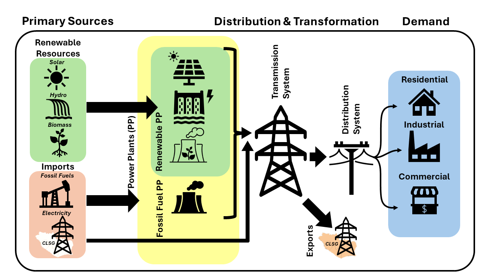
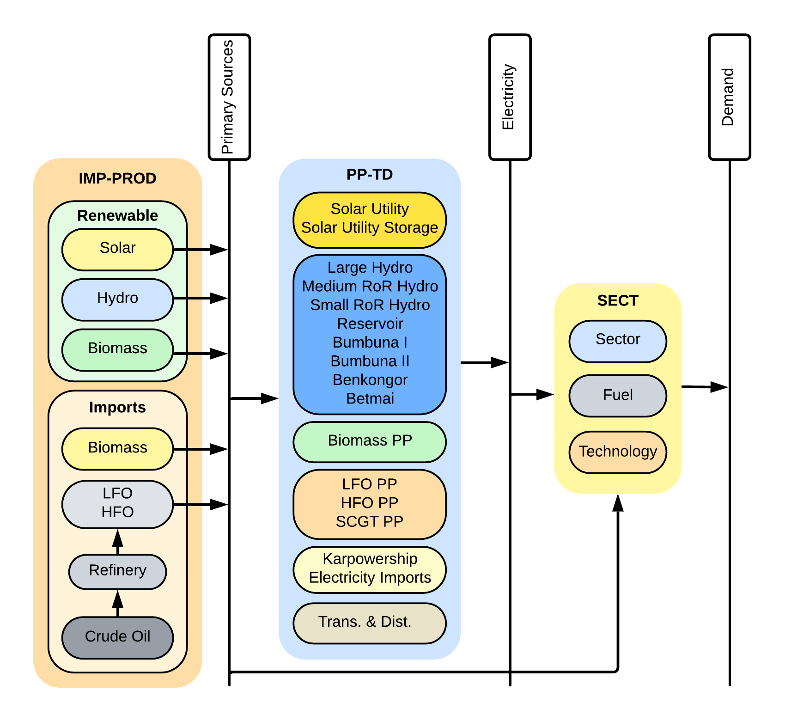

4. OSeMOSYS model: framework 
=======================================

This documentation has been created in order to provide an overview of OSeMOSYS-SL. Therefore, it presents the model structure, and gives a synthesis of the key assumptions of the model, regarding the numerical inputs used for the sets, parameters, and scenario building. First, in this section, we give an insight to the general framework of the model.

2.1 General model structure 
+++++++++

The Sierra Leonean energy sector is entirely modelled in OSeMOSYS. This has been built to focus on key concerns within the development of Sierra Leons's power sector, with key planned and prospective power plant projects such as the Bumbuna II (Yiben) modelled individually within the OSeMOSYs model. This model does not currently include demand or technologies driven by the transport sector in part due to a lack of available data. The overall structure of the model can be summarised in the simplified diagram Figure 2.1. with primary energy sourced from renewables, imported fossil fuels, domestic biomass or imported electricity. These commodities are transformed through a range of technologies to meet demands from different sectors as established in the MAED model, including Industrial, Commercial, and Residential household demands.  

*Figure 2.1: Simplified diagram for technologies within the Sierra Leone model*

The groups of technologies are summaried in figure 2.1 and described below.
The group IMP-PROD is used to represent the raw resources available to Sierra Leone

2.2 Sets 
+++++++++

The sets are responsible for defining the structure of the model (i.e. temporal space, geographic space, elements of the system, etc.). In OSeMOSYS, the group of sets include: years, fuels, technologies, emissions and modes of operation. As is going to be further explained, the sets are characterised through parameters. These subsections present the sets that compose the current version of OSeMOSYS-SL.  

2.2.1 Year
---------

This corresponds to the period of analysis. For OSeMOSYS-SL it is from 2015 to 2050. However, the data from 2015 to 2023 is set according to historical information. 

2.2.2 Fuels
---------
In the OSeMOSYS model fuels act as commodities, with their availability often split between the demand of several technologies. These are crutial in establishing limitations in the supply chain of Sierra Leone's power sector from the three main fuel sources of production, importation or renewable fuels available for use in energy generation within Sierra Leone.  

2.2.3 Technologies
---------

*Figure 2.1.3: Simplified diagram of the technology groupings used within the Sierra Leone OSeMOSYS model*

Groups of technologies represented in Figure 2.1.3 have been simplified from the technologies that can be found in the Annex section. A description of each grouping can be found below:

The first group, labelled IMP-PROD is used within the model to represent the availability and processing of raw commodities for use in energy generation within Sierra Leone. This can be directly in use in power plants as is the case with all renewables, as well as imported Heavy Fuel Oil (HFO) and Light Fuel Oil (LFO). However for Crude Oil imports, this includes the processing of this to generate HFO and LFO fuels. 

The second grouping labelled PP-TD represents Sierra Leone's power sector infrastructure, including renewable and non-renewable power generation from raw commodities, the transmission and distribution, and the import of energy both internationally and from Karpowership.

The last grouping labelled as SECT represents the division of energy within Sierra Leone's sectors. This includes the use of some primary commodities such as biomass in heating and cooking which constitutes a large portion of Sierra Leone's energy use, as well as the division of fuels and energy within Sierra Leone's sectors. This is driven by the demands predicted by MAED for Sierr Leone's Residential, Industrial and Commercial sectors. 

Table 2.1.3 summarises these groupings in OSeMOSYS-SL.

2.2.4 Emissions
---------
This OSeMOSYS model focuses on accounting for the CO2 emissions associated with the energy generating technologies as a key concerrn for Sierra Leone's climate initiatives. The addition of the transport sector in the modelling would further the national emissions. 

2.2.5 Mode of operation
---------
The model has one mode of operation, for representing the normal operation of the system. Scenario design can be found in Section 6.   

2.2.6 Region
---------

The model has a nationwide scope, therefore it only has one region: Sierra Leone (SL).
