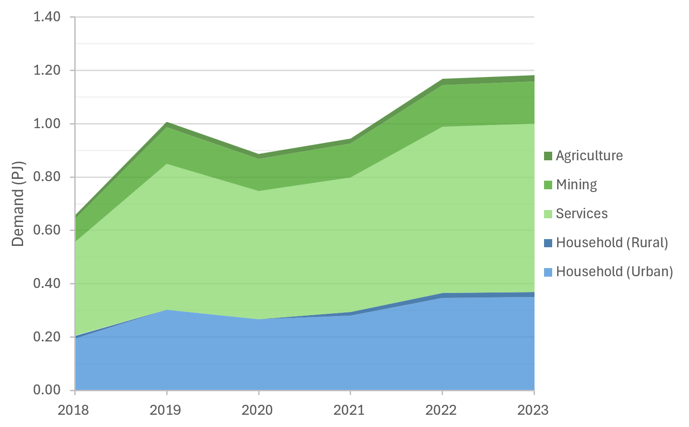
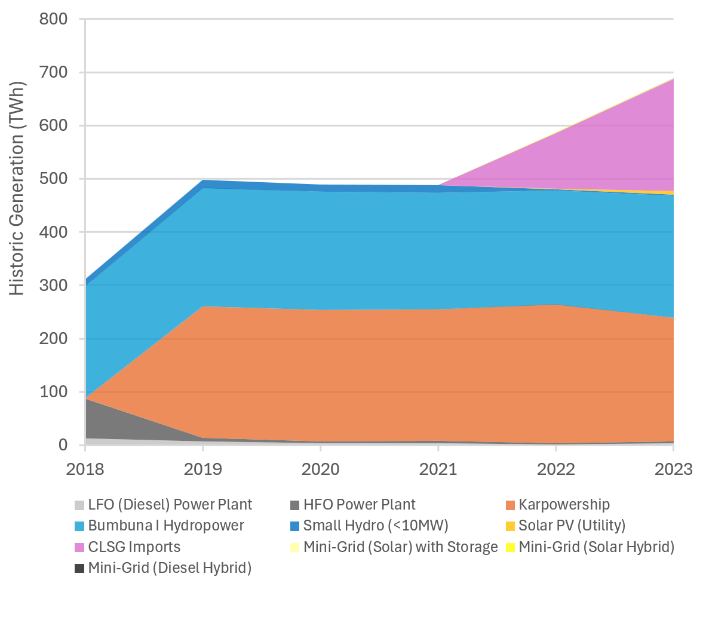

5. OSeMOSYS model: Database
=======================================
This section presents the main databases explored for building OSeMOSYS-SL, and the way the information was processed in order to introduce it to the model. 

5.1 Main data sources
+++++++++

5.1.1 Energy balance of Sierra Leone
---------
The energy balance is the most important source of data for the energy model of OSeMOSYS-SL. Projections for the sectoral energy demands within Sierra Leone were projected based on historic data made available by EDSA, and modelled using MAED as outlined in sections 2 and 3. The baseline historic energy balance is used as a basis for modelling is illustrated in Figure 5.2 below.

   *Figure 5.1.1: Summary of Sierra Leone's power sector energy demand across baseline years*

5.1.2 Other key databases 
---------
In the model, all fuels and technologies are incorporated to OSeMOSYS taking into account other sets, such as temporary divisions and emission, as well as the parameters. The latter are classified, among others, into costs, activity levels and infrastructure capacities. The establishment of these parameters was done after processing and reviewing the available national energy data. Table 5.1.2 summarizes the main souces of data for OSeMOSYS-CR. 

.. table:: 
   :align:   center
+---------------+---------------------------------+--------------------------+------------------------------------------------------------------------------------+
| Category      | Source                          | Data                     | Descriptions and assumption made                                                   |
+===============+=================================+==========================+====================================================================================+
| Demand        | MAED                            | Final energy             | Final energy demand for the three sectors modelled in the OSeMOSYS-SL model        |
|               |                                 |                          | was calculated through the modelling outlined for the Sierra Leone MAED            |
|               |                                 |                          | Demand model outlined in sections 2 and 3.                                         |
+---------------+---------------------------------+--------------------------+------------------------------------------------------------------------------------+
| Technology    | IRENA                           | Capital Costs            | Capital cost data for each technology used in the OSeMOSYS-SL model informs the    |
| Costs         |                                 |                          | model with regards costs associated with the construction of additional capacity   |
|               |                                 |                          | allowing for cost-optomization of the least cost power development strategy.       |
+               +                                 +                          +                                                                                    +
+               +                                 +                          +                                                                                    +
|               | Sierra Leone Ministry of Energy |                          |                                                                                    |
+               +                                 +                          +                                                                                    +
+               +                                 +                          +                                                                                    +
|               | NREL                            |                          |                                                                                    |
+               +                                 +                          +                                                                                    +
+               +                                 +                          +                                                                                    +
|               | Scientific literature           |                          |                                                                                    |
+               +---------------------------------+--------------------------+------------------------------------------------------------------------------------+
|               | IRENA                           | Fixed Costs              | Fixed costs for each technology highlight the operational and maintenance costs    |
|               |                                 |                          | for each technology excluding the fuel costs. This allows the OSeMOSYS-SL model to |
|               |                                 |                          | include these costs in the cost-optomization in order to establish the least-cost  |
|               |                                 |                          | approach that meets predicted energy demand in Sierra Loene.                       |
+               +                                 +                          +                                                                                    +
+               +                                 +                          +                                                                                    +
|               | Sierra Leone Ministry of Energy |                          |                                                                                    |
+               +                                 +                          +                                                                                    +
+               +                                 +                          +                                                                                    +
|               | The Sierra Leone Telegraph      |                          |                                                                                    |
+               +                                 +                          +                                                                                    +
+               +                                 +                          +                                                                                    +
|               | TEMBA                           |                          |                                                                                    |
+               +                                 +                          +                                                                                    +
+               +                                 +                          +                                                                                    +
|               | Scientific literature           |                          |                                                                                    |
+               +---------------------------------+--------------------------+------------------------------------------------------------------------------------+
|               | IRENA                           | Variable Costs           | The variable costs for each technology are the costs associated with fuel use for  |
|               |                                 |                          | each technology. As such, this cost scales with technology activity rates rather   |
|               |                                 |                          | than with capacity for its use in establishing the least cost power development    |
|               |                                 |                          | strategy.                                                                          |
+               +                                 +                          +                                                                                    +
+               +                                 +                          +                                                                                    +
|               | GlobalPetrolPrices              |                          |                                                                                    |
+               +                                 +                          +                                                                                    +
+               +                                 +                          +                                                                                    +
|               | World Bank                      |                          |                                                                                    |
+---------------+---------------------------------+--------------------------+------------------------------------------------------------------------------------+
| Technology    | IRENA                           | Operational Lifetimes    | Operational life reflects the life-span over which each technology is able to      |
| Variables     |                                 |                          | operate following the capital cost investment and capacity construction within the |
|               |                                 |                          | model. This allows for more accurate representation of costs within the            |
|               |                                 |                          | OSeMOSYS-SL model.                                                                 |
+               +                                 +                          +                                                                                    +
+               +                                 +                          +                                                                                    +
|               | Scientific literature           |                          |                                                                                    |
+               +---------------------------------+--------------------------+------------------------------------------------------------------------------------+
|               | IRENA                           | Efficiencies             | Efficiencies are used to represent the efficiency with which energy from primary   |
|               |                                 |                          | sources such as fuels are converted into usable energy required to meet final      |
|               |                                 |                          | energy demand.                                                                     |
+               +                                 +                          +                                                                                    +
+               +                                 +                          +                                                                                    +
|               | EDSA                            |                          |                                                                                    |
+               +                                 +                          +                                                                                    +
+               +                                 +                          +                                                                                    +
|               | EIA                             |                          |                                                                                    |
+               +---------------------------------+--------------------------+------------------------------------------------------------------------------------+
|               | IPCC                            | Emissions Factors        | Emission factors attribute a CO₂ emmission factor to the use of each               |
|               |                                 |                          | carbon-emitting fuel. This scales based on the activity and use of each of these   |
|               |                                 |                          | fuels in order to enable accounting of these emissions in order to meet key        |
|               |                                 |                          | policy regarding emissions targets.                                                |
+               +---------------------------------+--------------------------+------------------------------------------------------------------------------------+
|               | Sierra Leone Ministry of Energy | Capacity Factors         | Capacity factors are used to represent the activity of each technology as a factor |
|               |                                 |                          | of its potential generation if operated continuously. This was calculated from     |
+               +                                 +                          +                                                                                    +
+               +                                 +                          +                                                                                    +
|               | EDSA                            |                          |                                                                                    |
+               +                                 +                          +                                                                                    +
+               +                                 +                          +                                                                                    +
|               | World Bank                      |                          |                                                                                    |
+               +                                 +                          +                                                                                    +
+               +                                 +                          +                                                                                    +
|               | IRENA                           |                          |                                                                                    |
+               +                                 +                          +                                                                                    +
+               +                                 +                          +                                                                                    +
|               | Scientific literature           |                          |                                                                                    |
+               +---------------------------------+--------------------------+------------------------------------------------------------------------------------+
|               | Sierra Leone Ministry of Energy | Residual Capacities      | Residual capacities ensure that the OSeMOSYS-SL accurately depict Sierra Leone's   |
|               |                                 |                          | existing and committed capacity based on historic generation and policies.         |
+               +                                 +                          +                                                                                    +
+               +                                 +                          +                                                                                    +
|               | IRENASTAT                       |                          |                                                                                    |
+               +                                 +                          +                                                                                    +
+               +                                 +                          +                                                                                    +
|               | EDSA                            |                          |                                                                                    |
+               +                                 +                          +                                                                                    +
+               +                                 +                          +                                                                                    +
|               | SLEWRC                          |                          |                                                                                    |
+               +---------------------------------+--------------------------+------------------------------------------------------------------------------------+
|               | Sierra Leone Ministry of Energy | Potentials and Reserves  | Used to estimate primary resources and commodities available for use in Sierra     |
|               |                                 |                          | Leone's power sector.                                                              |
+               +                                 +                          +                                                                                    +
+               +                                 +                          +                                                                                    +
|               | Scientific literature           |                          |                                                                                    |
+---------------+---------------------------------+--------------------------+------------------------------------------------------------------------------------+
| Baseline      | EDSA                            | Historic Generation      | Sierra Leone's historic power generation for a baseline period between 2018 and    |
|               |                                 |                          | 2023.                                                                              |
+               +                                 +                          +                                                                                    +
+               +                                 +                          +                                                                                    +
|               | EGTC                            |                          |                                                                                    |
+---------------+---------------------------------+--------------------------+------------------------------------------------------------------------------------+

*Table 5.1.2 Main data sources used in OSeMOSYS-SL.*

5.2 Main Data Inputs
++++++++++

5.2.1 Sierra Leone power-sector capital costs
---------
Capital costs for power projects within Sierra Leone were collected from sources reported in Table 5.1.1.These costs reflect the cost associated with the construction of these power plants in order to meet the national demands predicted by OSeMOSYS. This is assumed to remain constant for many technologies, however for rapidly developing technologies such as solar, learning curves account for decreases in the technological cost associated with increased uptake of solar. Similarly, for technologies with no associated capital costs such as Karpowership, this was set to →0 for modelling purposes. A summary of these costs can be found in subsection *A1* of the Annex. Transmission and distribution costs were assumed to remain constant throughout the modelling period. A summary of this data is also available in subsection *A2* of the Annex section, with the full data available through the data repository associated with this documentation. 

5.2.1 Summary of Sierra Leone's technology operational life times.
----------
Operational life dictates the time span over which a power plant is able to operate following its comission. 

.. table:: 
   :align:   center
+------------------------------------+------------------------------------+------------------------------------+------------------------------------+
| Technology                         |      Operational Life (Years)      | Technology                         |      Operational Life (Years)      |
+====================================+====================================+====================================+====================================+
| Biomass Power Plant                |                 30                 | Medium Hydro (10-100MW)            |                 50                 |
+------------------------------------+------------------------------------+------------------------------------+------------------------------------+
| Coal Power Plant                   |                 35                 | Small Hydro (<10MW)                |                 50                 |
+------------------------------------+------------------------------------+------------------------------------+------------------------------------+
| LFO (Diesel) Power Plant           |                 25                 | Mini-Grid (Solar) with Storage     |                 25                 |
+------------------------------------+------------------------------------+------------------------------------+------------------------------------+
| HFO Power Plant                    |                 25                 | Mini-Grid (Diesel)                 |                 25                 |
+------------------------------------+------------------------------------+------------------------------------+------------------------------------+
| Gas Plant (CCGT)                   |                 30                 | Mini-Grid (Hydro)                  |                 50                 |
+------------------------------------+------------------------------------+------------------------------------+------------------------------------+
| Gas Plant (SCGT)                   |                 25                 | Mini-Grid (Solar Hybrid)           |                 25                 |
+------------------------------------+------------------------------------+------------------------------------+------------------------------------+
| Karpowership                       |                 1                  | Mini-Grid (Diesel Hybrid)          |                 25                 |
+------------------------------------+------------------------------------+------------------------------------+------------------------------------+
| Bumbuna Hydropower                 |                 50                 | Solar PV (Utility)                 |                 24                 |
+------------------------------------+------------------------------------+------------------------------------+------------------------------------+
| Betmai Hydropower                  |                 50                 | Solar PV (Utility with Storage)    |                 24                 |
+------------------------------------+------------------------------------+------------------------------------+------------------------------------+
| Bekongor Hydropower                |                 50                 | Floating Solar PV (Utility)        |                 20                 |
+------------------------------------+------------------------------------+------------------------------------+------------------------------------+
| Singimi Hydropower                 |                 50                 | Off-Grid Generation (Diesel)       |                 10                 |
+------------------------------------+------------------------------------+------------------------------------+------------------------------------+
| Bumbuna I 50 MW                    |                 50                 | Off-Grid Generation (Solar PV)     |                 24                 |
+------------------------------------+------------------------------------+------------------------------------+------------------------------------+
| Bumbuna I 88 MW                    |                 50                 | Off-Grid Generation (Hydro)        |                 50                 |
+------------------------------------+------------------------------------+------------------------------------+------------------------------------+
| Bumbuna II 55MW                    |                 50                 | Crude Oil Refinery                 |                 35                 |
+------------------------------------+------------------------------------+------------------------------------+------------------------------------+
| Hydropower with Reservoir          |                 50                 | Electricity Imports (Guinea)       |                  1                 |
+------------------------------------+------------------------------------+------------------------------------+------------------------------------+
| Large Hydro (>100MW)               |                 50                 | Electricity Imports (CLSG)         |                  1                 |
+------------------------------------+------------------------------------+------------------------------------+------------------------------------+
*Table 5.2.1 (a) Operational life of power generation technologies in Sierra Leone*

.. table:: 
   :align:   center
+------------------------------------+------------------------------------+
| Technology                         |      Operational Life (Years)      |
+====================================+====================================+
|  Transmission (Grid)               |                70                  |
+------------------------------------+------------------------------------+
|  Distribution (Grid)               |                70                  |
+------------------------------------+------------------------------------+
|  Transmission (Mini-Grid)          |                70                  |
+------------------------------------+------------------------------------+
*Table 5.2.1 (b) Operational life of power transmission and distribution technologies in Sierra Leone*

5.2.2 Sierra Leone power-sector fixed costs.
----------
Fixed costs represent the costs associated with the operation and mainenance of power plants in Sierra Leone. For most technologies this value remaind constant over the modelling period, however for a few such as solar-hybrid mini-grids this is projected to fall with time. For the costs associated with Karpowership, a value within the range shown within the table found in subsection *A3* of the Annex was used to estimate fixed costs. The fixed costs for transmission and distribution are modelled as 0 and can be found in subsection *A4* of the Annex.  

5.2.3 Summary of variable costs in Sierra Leone 
----------
Variable costs are used to model the fuel costs associated with the activity of power generating technologies within the energy model. This cost is scaled with the level of activity and the fuel type associated with each technology. These costs are summaried in the table below, with the full data available through the data repository associated with this documentation.

+------------------------------------+--------------------+--------------------+--------------------+--------------------+
| Commodity                          |                                 Fuel Price ($/GJ)                                 |
+                                    +--------------------+--------------------+--------------------+--------------------+
|                                    |        2024        |        2030        |        2040        |        2050        |
+====================================+====================+====================+====================+====================+
| Crude Oil Imports                  |        12.6        |        14.3        |        16.9        |       19.5         |
+------------------------------------+--------------------+--------------------+--------------------+--------------------+
| Biomass Extraction                 |        1.6         |        1.6         |        1.6         |        1.6         |
+------------------------------------+--------------------+--------------------+--------------------+--------------------+
| Coal Imports                       |        5.3         |        5.5         |        5.9         |        5.9         |
+------------------------------------+--------------------+--------------------+--------------------+--------------------+
| LFO (Diesel) Imports               |        34.4        |        36.3        |        39.5        |        42.6        |
+------------------------------------+--------------------+--------------------+--------------------+--------------------+
| HFO (Heavy Fuel Oil) Imports       |        9.2         |        10.4        |        12.3        |        14.2        |
+------------------------------------+--------------------+--------------------+--------------------+--------------------+
| Natural Gas Imports                |        10.5        |        11.5        |        13.7        |        13.7        |
+------------------------------------+--------------------+--------------------+--------------------+--------------------+

*Table 5.2.3 Variable Costs associated with fuel use in power generation in Sierra Leone.*

5.2.4 Fuel emission factors 
----------
Emissions factors are used to measure modelled power-sector development with regards to meeting emissions targets. Emissions are scaled by the amount of each fuel used through the activity of each power generating technology within the model. A summary of the CO₂ emissions factors for each fuel is shown in the table below. 

+------------------------------------+--------------------------------------------------------------------------+
| Fuel                               |                      CO₂ Emission Factor (kgCO₂/GJ)                      |
+====================================+==========================================================================+
| Crude Oil                          |                                   73.3                                   |
+------------------------------------+--------------------------------------------------------------------------+
| Biomass                            |                                   100                                    |
+------------------------------------+--------------------------------------------------------------------------+
| Coal                               |                                   94.6                                   |
+------------------------------------+--------------------------------------------------------------------------+
| LFO (Diesel)                       |                                   74.1                                   |
+------------------------------------+--------------------------------------------------------------------------+
| HFO (Heavy Fuel Oil)               |                                   77.4                                   |
+------------------------------------+--------------------------------------------------------------------------+
| Natural Gas                        |                                   56.1                                   |
+------------------------------------+--------------------------------------------------------------------------+
*Table 5.2.4 CO₂ Emission Factors for Fuels used in power generation in Sierra Leone.*

5.2.5 Efficiencies in Sierra Leone's power sector
----------
In the OSeMOSYS-SL model, efficiencies are used to represent the ratios between energy input from fuel sources, and the electricity output from each power generating technology as an input-output activity ratio. For renewable resources, this is considered to be 100%, however for other generation technologies, as well as transmission and distribution, this value can vary, and can represent inefficiencies within the power sector. For Sierra Leone, data suggest moderate increases in the efficiency of the distribution infrastructure as shown in table 5.2.5 below.

+------------------------------------+------------------------------------+------------------------------------+------------------------------------+
| Technology                         |             Efficiency (%)         | Technology                         |             Efficiency (%)         |
+====================================+====================================+====================================+====================================+
| Biomass Power Plant                |                 35                 | Mini-Grid (Diesel Hybrid)          |                 35                 |
+------------------------------------+------------------------------------+------------------------------------+------------------------------------+
| Coal Power Plant                   |                 37                 | Off-Grid Generation (Diesel)       |                 16                 |
+------------------------------------+------------------------------------+------------------------------------+------------------------------------+
| LFO (Diesel) Power Plant           |                 35                 | Crude Oil Refinery (Gasoline)      |                 60                 |
+------------------------------------+------------------------------------+------------------------------------+------------------------------------+
| HFO Power Plant                    |                 35                 | Crude Oil Refinery (Diesel)        |                 30                 |
+------------------------------------+------------------------------------+------------------------------------+------------------------------------+
| Gas Plant (CCGT)                   |                 48                 | Crude Oil Refinery (HFO)           |                 10                 |
+------------------------------------+------------------------------------+------------------------------------+------------------------------------+
| Gas Plant (SCGT)                   |                 30                 | All Solar and Hydro power          |                 100                |
|                                    |                                    | Renewable Technologies             |                                    |
+------------------------------------+------------------------------------+------------------------------------+------------------------------------+
| Karpowership                       |                 35                 | All Electricity Imports            |                 100                |
+------------------------------------+------------------------------------+------------------------------------+------------------------------------+
| Mini-Grid (Diesel)                 |                 35                 |                                                                         |
+------------------------------------+------------------------------------+------------------------------------+------------------------------------+
*Table 5.2.5 (a) Operational efficiencies for power generating technologies in Sierra Leone*

+------------------------------------+--------------+--------------+--------------+--------------+--------------+--------------+
| Technology                         |                                       Efficiency (%)                                    |
+                                    +--------------+--------------+--------------+--------------+--------------+--------------+
|                                    |     2021     |     2022     |     2023     |     2030     |     2040     |     2050     |
+====================================+==============+==============+==============+==============+==============+==============+ 
| Transmission (Grid)                |      95      |      95      |      95      |      95      |      95      |      95      |
+------------------------------------+--------------+--------------+--------------+--------------+--------------+--------------+
| Distribution (Grid)                |      56      |      58      |      50      |      53      |      56      |      60      |
+------------------------------------+--------------+--------------+--------------+--------------+--------------+--------------+
| Distribution (Mini-Grid)           |      56      |      58      |      50      |      53      |      56      |      60      |
+------------------------------------+--------------+--------------+--------------+--------------+--------------+--------------+
*Table 5.2.5 (b) Operational efficiencies for transmission and distribution technologies in Sierra Leone*

5.2.6 Capacity Factors for power sector technologies in Sierra Leone
----------
Capacity factors give ratio of the real energy produced by each technology during a set period as a factor of of the energy production for each technology if operating continuously over the same period. 

+-----------------------------------+---------------------------------------+-----------------------------------+---------------------------------------+
| Technology                        | Average Capacity Factor (%)           | Technology                        | Average Capacity Factor (%)           |
+===================================+=======================================+===================================+=======================================+
| Biomass Power Plant               | 43                                    | Large Hydro (>100MW)              | 36                                    |
+-----------------------------------+---------------------------------------+-----------------------------------+---------------------------------------+
| Coal Power Plant                  | 57                                    | Medium Hydro (10-100MW)           | 36                                    |
+-----------------------------------+---------------------------------------+-----------------------------------+---------------------------------------+
| LFO (Diesel) Power Plant          | 30                                    | Small Hydro (<10MW)               | 36                                    |
+-----------------------------------+---------------------------------------+-----------------------------------+---------------------------------------+
| HFO Power Plant                   | 30                                    | Mini-Grid (Solar) with Storage    | 15                                    |
+-----------------------------------+---------------------------------------+-----------------------------------+---------------------------------------+
| Gas Plant (CCGT)                  | 57                                    | Mini-Grid (Diesel)                | 30                                    |
+-----------------------------------+---------------------------------------+-----------------------------------+---------------------------------------+
| Gas Plant (SCGT)                  | 57                                    | Mini-Grid (Hydro)                 | 36                                    |
+-----------------------------------+---------------------------------------+-----------------------------------+---------------------------------------+
| Karpowership                      | 46                                    | Mini-Grid (Solar Hybrid)          | 15                                    |
+-----------------------------------+---------------------------------------+-----------------------------------+---------------------------------------+
| Bumbuna Hydropower (without Yiben)| 53                                    | Mini-Grid (Diesel Hybrid)         | 30                                    |
+-----------------------------------+---------------------------------------+-----------------------------------+---------------------------------------+
| Bumbuna Hydropower (with Yiben)   | 72                                    | Solar PV (Utility)                | 13                                    |
+-----------------------------------+---------------------------------------+-----------------------------------+---------------------------------------+
| Betmai Hydropower                 | 36                                    | Solar PV (Utility with Storage)   | 15                                    |
+-----------------------------------+---------------------------------------+-----------------------------------+---------------------------------------+
| Bekongor Hydropower               | 36                                    | Floating Solar PV (Utility)       | 11                                    |
+-----------------------------------+---------------------------------------+-----------------------------------+---------------------------------------+
| Singimi Hydropower                | 36                                    | Off-Grid Generation (Diesel)      | 30                                    |
+-----------------------------------+---------------------------------------+-----------------------------------+---------------------------------------+
| Bumbuna I 50 MW (without Yiben)   | 49                                    | Off-Grid Generation (Solar PV)    | 15                                    |
+-----------------------------------+---------------------------------------+-----------------------------------+---------------------------------------+
| Bumbuna I 50 MW (with Yiben)      | 90                                    | Off-Grid Generation (Hydro)       | 36                                    |
+-----------------------------------+---------------------------------------+-----------------------------------+---------------------------------------+
| Bumbuna I 88 MW                   | 86                                    | Crude Oil Refinery                | 100                                   |
+-----------------------------------+---------------------------------------+-----------------------------------+---------------------------------------+
| Bumbuna II 55MW                   | 90                                    | Electricity Imports (Guinea)      | 100                                   |
+-----------------------------------+---------------------------------------+-----------------------------------+---------------------------------------+
| Hydropower with Reservoir         | 36                                    | Electricity Imports (CLSG)        | 100                                   |
+-----------------------------------+---------------------------------------+-----------------------------------+---------------------------------------+
*Table 5.2.6 Capacity Factors for Sierra Leone's power sector technologies.*

Capacity factors for transmission and distribution are assumed to be 100% for modelling purposes. 

5.2.7 Residual capacities and committed capacities for Power plants in Sierra Leone.
----------

Residual and committed capacities are used to reflect existing or committed power plant capacities and policies in Sierra Leone. These are based on the baseline historic generation capacity in Sierra Leone, power plants and transmission and distribution projects that the government of Sierra Leone has committed to meet. This historic and committed capacity data is used to ensure that the OSeMOSYS-SL model accurately represents Sierra Leone's planned power development strategies and policies, whilst allowing OSeMOSYS to optomise capacity required to meet remaining energy demand. A summary of these residual capacities can be found in subsection A5 of the Annex.

5.2.8 Resource potentials in Sierra Leone
----------
The table below summarises key resource potentials for Sierra Leone's power sector. This is dominated by solar and hydro power, with wind currently not considered a viable option of the development of Sierra Leone's power sector, and no known viable domestic fossil fuel reserves. Biomass has also been set to 0 due to the closure of the recently developed Addax Biomass power plant due to insufficient biomass avialability.  

+---------------------------------------------------+----------------------+
| Resource Units                                    |  Resource Potential  |
+===================================================+======================+
| Solar PV (*MW*)                                   |        171,000       |
+---------------------------------------------------+----------------------+
| Solar CSP (*MW*)                                  |        22,500        |
+---------------------------------------------------+----------------------+
| Large Hydropower(>100MW) (*MW*)                   |          461         |
+---------------------------------------------------+----------------------+
| Medium Hydropower (10-100MW) (*MW*)               |          990         |
+---------------------------------------------------+----------------------+
| Small Hydropower (<10MW) (*MW*)                   |          3,000       |
+---------------------------------------------------+----------------------+
| Wind (*MW*), Biomass (*PJ*), Coal (*PJ*), Natural |            0         |
+                                                   +                      + 
| Gas (*PJ*), Crude Oil (*PJ*), Uranium (*PJ*)      |                      |
+---------------------------------------------------+----------------------+
*Table 5.2.8 Domestic resource potentials for power generation in Sierra Leone.* 

5.2.9 Historic Generation in Sierra Leone
----------
Historic power-sector generation and energy imports in Sierra Leone are visualised in the  figure below, whilst a table of this data can be found in subsection A6 of the Annex. Mini-grids are not currently included in the OSeMOSYS-SL model, however have been included for future modelling efforts. 

*Figure 5.1.1 Graph showing Sierra Leone's historic generation between 2018 and 2023 in TWh*
