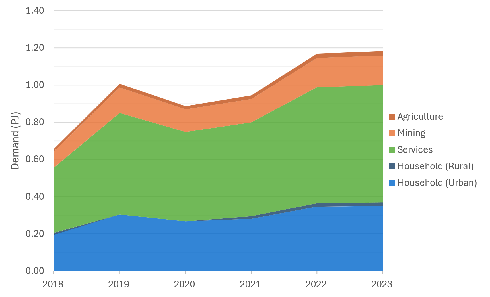

5. OSeMOSYS model: Database
=======================================
This section presents the main databases explored for building OSeMOSYS-SL, and the way the information was processed in order to introduce it to the model. 

3.1 Main data sources
+++++++++

3.1.1 Energy balance of Sierra Leone
---------

The energy balance is the most important source of data for the energy model of OSeMOSYS-SL. Projections for the sectoral energy demands within Sierra Leone were projected based on historic data made available by EDSA, and modelled using MAED as outlined in sections 2 and 3. The baseline historic energy balance is used as a basis for modelling is illustrated in Figure 3.1.1 below.

   *Figure 3.1.1: Summary of Sierra Leone's power sector energy demand across baseline years*

3.1.2 Other key databases 
---------

In the model, all fuels and technologies are incorporated to OSeMOSYS taking into account other sets, such as temporary divisions and emission, as well as the parameters. The latter are classified, among others, into costs, activity levels and infrastructure capacities. The establishment of these parameters was done after processing and reviewing the available national energy data. Table 3.1 summarizes the main souces of data for OSeMOSYS-CR. 

*Table 3.1.2: Main data sources used in OSeMOSYS-CR.*

.. table:: 
   :align:   center
+--------------+------------+--------------------------+------------------------------------------------------------------------------+
| Category     | Source     | Data                     | Descriptions and assumption made                                             |
+==============+============+==========================+==============================================================================+
| Energy       |            | Energy balance           |                                                                              |
| System       |            |                          |                                                                              |
+--------------+------------+--------------------------+------------------------------------------------------------------------------+
| Demand       |            | Final energy             |                                                                              |
|              |            |                          |                                                                              |
+              +------------+--------------------------+------------------------------------------------------------------------------+
|              |            | Transport                |                                                                              |
|              |            | (passengers and cargo)   |                                                                              |
|              |            |                          |                                                                              |
|              |            |                          |                                                                              |
+--------------+------------+--------------------------+------------------------------------------------------------------------------+
|Electricity   | IEA        | Capital and fixed costs  | Based on national data. The costs were assumed constant in the whole period, |
|technologies  |            |                          | except for solar and wind systems, which decrease according to international |
|              |            |                          |                                                                              |
+              +------------+--------------------------+------------------------------------------------------------------------------+
|              |            | Capacity and activity    | Based on the operational performance registered by the National Energy       |
|              |            |                          | Control Centre. Operational life is according to national plans.             |
+--------------+------------+--------------------------+------------------------------------------------------------------------------+
|Transport     |            | Capital and fixed costs  | Based on the Ministry of Finance (Hacienda) database. We assumed that cost of|
|technologies  |            |                          | electric vehicles decreases (Bloomberg). For cargo transport, we review cost |
|              |            |                          | of companies like Nicola and Tesla.                                          |
+              +------------+--------------------------+------------------------------------------------------------------------------+
|              |            | Capacity and activity    | Based on the performance register by national surveys, concession for public |
|              |            |                          | transport and the annual Vehicle technical review (RITEVE). Operational life |
|              |            |                          | is according to manufacturers and the residual capacity decreases linearly   | 
|              |            |                          | and proportionally with this value.                                          |
+--------------+------------+--------------------------+------------------------------------------------------------------------------+
|Fuel prices   | IEA        | Fossil Fuels and Biofuels| Based on current tariffs and projection uses in national plans. It considers |
|              |            |                          | international prices and the tariff given by the regulator in Costa Rica     |
|              |            |                          | (ARESEP) and trend provide by international Energy Agency (IEA).             |
+              +------------+--------------------------+------------------------------------------------------------------------------+
|              |            | Electricity              | Base of the average of national tariffs and projections.                     |
|              |            |                          |                                                                              |
+              +------------+--------------------------+------------------------------------------------------------------------------+
|              |            | Biomass                  |  Not included. It is produced and consumed locally.                          |
+              +------------+--------------------------+------------------------------------------------------------------------------+
|              |            | Hydrogen                 | Based on data published by ETSAP.                                            |
+--------------+------------+--------------------------+------------------------------------------------------------------------------+
|Infrastrucure |            | Plants and power grid    | Based on Transmission and generation national plans. It assumes losses of 4% |
|              |            |                          | from the bulk transmission system and 6% for distribution. Charging          |
|              |            |                          | infrastructure is not included.                                              |
+              +------------+--------------------------+------------------------------------------------------------------------------+
|              |            | Pipeline and road        | Based on national reports, we consider the current infraestructure does not  |
|              |            | distribution             | grow (gasoline and diesel). It includes new infrastructure for LPG. The model|
|              |            |                          |                                                                              |
+              +------------+--------------------------+------------------------------------------------------------------------------+
|              |            | Hydrogen                 |                                                                              |
+--------------+------------+--------------------------+------------------------------------------------------------------------------+
| Sustainable  |            | Urban plans and mobility |                                                                              |
| mobility     |            |                          |                                                                              |
|              |            |                          |                                                                              |
+--------------+------------+--------------------------+------------------------------------------------------------------------------+
| Cargo        |            | Electric cargo train and |                                                                              |
| transport    |            | Logistic                 |                                                                              |
|              |            |                          |                                                                              |
+--------------+------------+--------------------------+------------------------------------------------------------------------------+
| Emissions    | IPCC       |  Factors                 | Based on the IPCC and the national GHG inventory.                            |
+--------------+------------+--------------------------+------------------------------------------------------------------------------+
| Co-benefits  |            | Coefficients             |                                                                              |
|              |            |                          |                                                                              |
+--------------+------------+--------------------------+------------------------------------------------------------------------------+

3.1 Main Data Inputs
++++++++++

3.2.1 Summary of Sierra Leone power plant capital costs
---------
Capital costs for power projects within Sierra Leone were collected from sources reported in Table 3.1.2.These costs reflect the cost associated with the construction of these power plants in order to meet the national demands predicted by OSeMOSYS. This is assumed to remain constant for many technologies, however for rapidly developing technologies such as solar, learning curves account for decreases in the technological cost associated with increased uptake of solar. Similarly, for technologies with no associated capital costs such as Karpowership, this was set to →0 for modelling purposes. A summary of these costs can be found in subsection A1 of the Annex, with the full data available through the data repository associated with this documentation. 

3.2.2 Summary of Sierra Leone transmission and distribution capital costs
---------

Transmission and distribution costs were assumed to remain constant throughout the modelling period. A summary of this data is also available in subsection A2 of the Annex section, with the full data available through the data repository associated with this documentation. 

3.2.3 Summary of Sierra Leone's technology operational life times.
----------

Operational life dictates the time span over which a power plant is able to operate following its comission. 

+------------------------------------+------------------------------------+------------------------------------+------------------------------------+
| Technology                         |      Operational Life (Years)      | Technology                         |      Operational Life (Years)      |
+====================================+====================================+====================================+====================================+
| Biomass Power Plant                |                 30                 | Medium Hydro (10-100MW)            |                 50                 |
+------------------------------------+------------------------------------+------------------------------------+------------------------------------+
| Coal Power Plant                   |                 35                 | Small Hydro (<10MW)                |                 50                 |
+------------------------------------+------------------------------------+------------------------------------+------------------------------------+
| LFO (Diesel) Power Plant           |                 25                 | Mini-Grid (Solar) with Storage     |                 25                 |
+------------------------------------+------------------------------------+------------------------------------+------------------------------------+
| HFO Power Plant                    |                 25                 | Mini-Grid (Diesel)                 |                 25                 |
+------------------------------------+------------------------------------+------------------------------------+------------------------------------+
| Gas Plant (CCGT)                   |                 30                 | Mini-Grid (Hydro)                  |                 50                 |
+------------------------------------+------------------------------------+------------------------------------+------------------------------------+
| Gas Plant (SCGT)                   |                 25                 | Mini-Grid (Solar Hybrid)           |                 25                 |
+------------------------------------+------------------------------------+------------------------------------+------------------------------------+
| Karpowership                       |                 1                  | Mini-Grid (Diesel Hybrid)          |                 25                 |
+------------------------------------+------------------------------------+------------------------------------+------------------------------------+
| Bumbuna Hydropower                 |                 50                 | Solar PV (Utility)                 |                 24                 |
+------------------------------------+------------------------------------+------------------------------------+------------------------------------+
| Betmai Hydropower                  |                 50                 | Solar PV (Utility with Storage)    |                 24                 |
+------------------------------------+------------------------------------+------------------------------------+------------------------------------+
| Bekongor Hydropower                |                 50                 | Floating Solar PV (Utility)        |                 20                 |
+------------------------------------+------------------------------------+------------------------------------+------------------------------------+
| Singimi Hydropower                 |                 50                 | Off-Grid Generation (Diesel)       |                 10                 |
+------------------------------------+------------------------------------+------------------------------------+------------------------------------+
| Bumbuna I 50 MW                    |                 50                 | Off-Grid Generation (Solar PV)     |                 24                 |
+------------------------------------+------------------------------------+------------------------------------+------------------------------------+
| Bumbuna I 88 MW                    |                 50                 | Off-Grid Generation (Hydro)        |                 50                 |
+------------------------------------+------------------------------------+------------------------------------+------------------------------------+
| Bumbuna II 55MW                    |                 50                 | Crude Oil Refinery                 |                 35                 |
+------------------------------------+------------------------------------+------------------------------------+------------------------------------+
| Hydropower with Reservoir          |                 50                 | Electricity Imports (Guinea)       |                  1                 |
+------------------------------------+------------------------------------+------------------------------------+------------------------------------+
| Large Hydro (>100MW)               |                 50                 | Electricity Imports (CLSG)         |                  1                 |
+------------------------------------+------------------------------------+------------------------------------+------------------------------------+

3.2.4 Summary of Sierra Leone power plant fixed costs.
----------
Fixed costs represent the costs associated with the operation and mainenance of power plants in Sierra Leone. For most technologies, however for a few such as Solar-hybrid mini-grids, this is projected to fall with time. A value within the range shown within this table was used for the modelling of fixed costs for Karpowership.

+------------------------------------+-------------------------+----------------+----------------+----------------+----------------+----------------+
| Power Plant Type                   | Power plant technology capital costs ($/kW)                                                                  |
|                                    |                                                                                                              |
+                                    +-------------------------+----------------+----------------+----------------+----------------+----------------+
|                                    |           2021          |      2022      |      2023      |      2030      |      2040      |      2050      |
+------------------------------------+-------------------------+----------------+----------------+----------------+----------------+----------------+
| Biomass Power Plant                |                       75|              75|              75|              75|              75|              75|
+------------------------------------+-------------------------+----------------+----------------+----------------+----------------+----------------+
| Coal Power Plant                   |                      112|             112|             112|             112|             112|             112|
+------------------------------------+-------------------------+----------------+----------------+----------------+----------------+----------------+
| LFO (Diesel) Power Plant           |                       23|              23|              23|              23|              23|              23|
+------------------------------------+-------------------------+----------------+----------------+----------------+----------------+----------------+
| HFO Power Plant                    |                       32|              32|              32|              32|              32|              32|
+------------------------------------+-------------------------+----------------+----------------+----------------+----------------+----------------+
| Gas Plant (CCGT)                   |                       30|              30|              30|              30|              30|              30|
+------------------------------------+-------------------------+----------------+----------------+----------------+----------------+----------------+
| Gas Plant (SCGT)                   |                       24|              24|              24|              24|              24|              24|
+------------------------------------+-------------------------+----------------+----------------+----------------+----------------+----------------+
| Karpowership                       |                  700-836|         836–700|         836–700|         836–700|         836–700|         836–700|
+------------------------------------+-------------------------+----------------+----------------+----------------+----------------+----------------+
| Bumbuna Hydropower                 |                      102|             102|             102|             102|             102|             102|
+------------------------------------+-------------------------+----------------+----------------+----------------+----------------+----------------+
| Betmai Hydropower                  |                       75|              75|              75|              75|              75|              75|
+------------------------------------+-------------------------+----------------+----------------+----------------+----------------+----------------+
| Bekongor Hydropower                |                       90|              90|              90|              90|              90|              90|
+------------------------------------+-------------------------+----------------+----------------+----------------+----------------+----------------+
| Singimi Hydropower                 |                       75|              75|              75|              75|              75|              75|
+------------------------------------+-------------------------+----------------+----------------+----------------+----------------+----------------+
| Bumbuna I 50 MW                    |                       45|              45|              45|              45|              45|              45|
+------------------------------------+-------------------------+----------------+----------------+----------------+----------------+----------------+
| Bumbuna I 88 MW                    |                      281|             281|             281|             281|             281|             281|
+------------------------------------+-------------------------+----------------+----------------+----------------+----------------+----------------+
| Bumbuna II 55MW                    |                      204|             204|             204|             204|             204|             204|
+------------------------------------+-------------------------+----------------+----------------+----------------+----------------+----------------+
| Hydropower with Reservoir          |                       90|              90|              90|              90|              90|              90|
+------------------------------------+-------------------------+----------------+----------------+----------------+----------------+----------------+
| Large Hydro (>100MW)               |                       90|              90|              90|              90|              90|              90|
+------------------------------------+-------------------------+----------------+----------------+----------------+----------------+----------------+
| Medium Hydro (10-100MW)            |                       75|              75|              75|              75|              75|              75|
+------------------------------------+-------------------------+----------------+----------------+----------------+----------------+----------------+
| Small Hydro (<10MW)                |                       90|              90|              90|              90|              90|              90|
+------------------------------------+-------------------------+----------------+----------------+----------------+----------------+----------------+
| Mini-Grid (Solar) with Storage     |                       46|              43|              40|              30|              25|              25|
+------------------------------------+-------------------------+----------------+----------------+----------------+----------------+----------------+
| Mini-Grid (Diesel)                 |                       90|              90|              90|              90|              90|              90|
+------------------------------------+-------------------------+----------------+----------------+----------------+----------------+----------------+
| Mini-Grid (Hydro)                  |                      120|             120|             120|             120|             120|             120|
+------------------------------------+-------------------------+----------------+----------------+----------------+----------------+----------------+
| Mini-Grid (Solar Hybrid)           |                       46|              43|              40|              30|              25|              25|
+------------------------------------+-------------------------+----------------+----------------+----------------+----------------+----------------+
| Mini-Grid (Diesel Hybrid)          |                       90|              90|              90|              90|              90|              90|
+------------------------------------+-------------------------+----------------+----------------+----------------+----------------+----------------+
| Solar PV (Utility)                 |                       11|              11|              11|              10|               9|               9|
+------------------------------------+-------------------------+----------------+----------------+----------------+----------------+----------------+
| Solar PV (Utility with Storage)    |                       17|              16|              15|              12|               9|               9|
+------------------------------------+-------------------------+----------------+----------------+----------------+----------------+----------------+
| Floating Solar PV (Utility)        |                       40|              40|              40|              40|              40|              40|
+------------------------------------+-------------------------+----------------+----------------+----------------+----------------+----------------+
| Off-Grid Generation (Diesel)       |                       32|              32|              32|              32|              32|              32|
+------------------------------------+-------------------------+----------------+----------------+----------------+----------------+----------------+
| Off-Grid Generation (Solar PV)     |                       83|              79|              76|              54|              42|              42|
+------------------------------------+-------------------------+----------------+----------------+----------------+----------------+----------------+
| Off-Grid Generation (Hydro)        |                       90|              90|              90|              90|              90|              90|
+------------------------------------+-------------------------+----------------+----------------+----------------+----------------+----------------+
| Crude Oil Refinery                 |                        0|               0|               0|               0|               0|               0|
+------------------------------------+-------------------------+----------------+----------------+----------------+----------------+----------------+
| Electricity Imports (Guinea)       |                      175|             175|             175|             175|             175|             175|
+------------------------------------+-------------------------+----------------+----------------+----------------+----------------+----------------+
| Electricity Imports (CLSG)         |                      175|             175|             175|             175|             175|             175|
+------------------------------------+-------------------------+----------------+----------------+----------------+----------------+----------------+

3.2.2 Summary of Sierra Leone transmission and distribution fixed costs
---------

The table below summarises the operation and maintenance costs used for modelling for Grid and Mini-grid transmission and distribution technologies in Sierra Leone.

.. table:: 
   :align:   center
+----------------------------------+-----------+-----------+-----------+-----------+-----------+-----------+
| Transmission and Distribution    | Transmission and  Distribution technology fixed costs ($/kW)          |
| Type                             |                                                                       |
+                                  +-----------+-----------+-----------+-----------+-----------+-----------+
|                                  |    2021   |    2022   |    2023   |    2030   |    2040   |    2050   |
+==================================+===========+===========+===========+===========+===========+===========+
| Transmission (Grid)              |     0     |     0     |     0     |     0     |     0     |     0     |
+----------------------------------+-----------+-----------+-----------+-----------+-----------+-----------+
| Distribution (Grid)              |     0     |     0     |     0     |     0     |     0     |     0     |
+----------------------------------+-----------+-----------+-----------+-----------+-----------+-----------+
| Distribution (Mini-Grid)         |     0     |     0     |     0     |     0     |     0     |     0     |
+----------------------------------+-----------+-----------+-----------+-----------+-----------+-----------+

