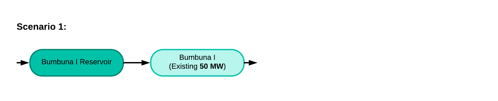
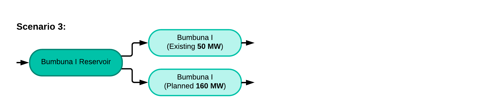
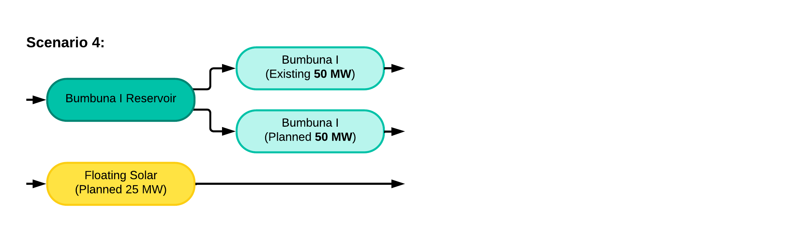
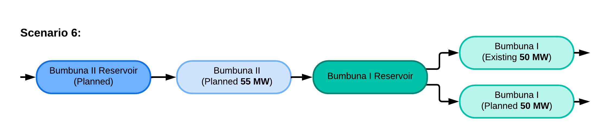
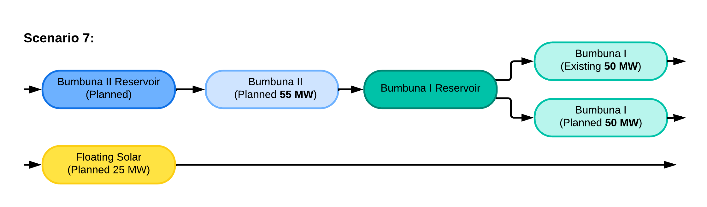

6. OSeMOSYS model: scenarios
=======================================

OSeMOSYS-SL started by estimating a base case, and subsequently, including the effect of a set of policies defined by stakeholders in a decarbonisation scenarios. This exercise allowed the creation of the following scenarios: 

6.1. Scenario 1
+++++++++

Scenario 1 outlines a "business-as-usual" (BAU) scenario, development of the power sector without any implementation of phase 2 of the bumbuna development and assuming no public policy intervention with regards to emissions (i.e. following the historic trends). 

   *Figure 6.1: Simplified visualisation of Scenario 1 for Bumbuna expansion in Sierra Leone*

6.2. Scenario 2
+++++++++

Scenario 2 assumes that the policy landscape remains the same as business-as-usual with regards to emissions targets, however includes the expansion of the existing bumbuna infrastructure with an additional 50 MW of capacity at the Bumbuna I site.

   *Figure 6.2: Simplified visualisation of Scenario 2 for Bumbuna expansion in Sierra Leone*

6.3. Scenario 3
+++++++++

Scenario 3 assumes that the policy landscape remains the same as business-as-usual with regards to emissions targets. However this scenario includes the expansion of the existing Bumbuna I capacity by an additional 160 MW.

   *Figure 6.3: Simplified visualisation of Scenario 3 for Bumbuna expansion in Sierra Leone*

6.4. Scenario 4
+++++++++

Scenario 4 also assumes that the policy landscape remains the same as business-as-usual with regards to emissions targets. This scenario is similar to Scenario 2 as it includes the expansion of the existing Bumbuna I infrastructure with the addition of 50 MW of capacity. However this scenario also includes the co-location of an additional 25 MW of co-located solar capacity. 

   *Figure 6.4: Simplified visualisation of Scenario 4 for Bumbuna expansion in Sierra Leone*

6.5. Scenario 5
+++++++++

 Scenario 5

   *Figure 6.5: Simplified visualisation of Scenario 5 for Bumbuna expansion in Sierra Leone*

6.6. Scenario 6
+++++++++

Scenario 6

   *Figure 6.6: Simplified visualisation of Scenario 6 for Bumbuna expansion in Sierra Leone*

6.7. Scenario 7
+++++++++

 Scenario 7

   *Figure 6.7: Simplified visualisation of Scenario 7 for Bumbuna expansion in Sierra Leone*

