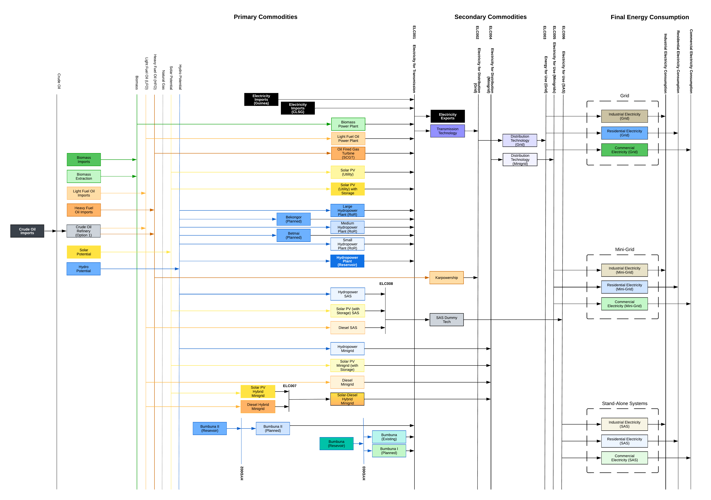

8. Annexes
=======================================
The following section contains tables of data used in the OSeMOSYS-SL energy modelling for Sierra Leone. The full data sets are available through the data repository associated with this documentation, with the data shown in this annex summarising this data across key years. 

A1. Summary of capital costs for power-sector technologies in Sierra Leone.
++++++++++

The following table summarises key capital cost data for power-sector technologies used in the OSeMOSYS-SL modelling across key years between 2021 and 2050.

.. table:: 
   :align:   center
+----------------------------------+-----------+-----------+-----------+-----------+-----------+-----------+ 
| Power Plant Type                 | Power plant technology capital costs ($/kW)                           | 
|                                  |                                                                       | 
+                                  +-----------+-----------+-----------+-----------+-----------+-----------+
|                                  | 2021      | 2022      | 2023      | 2030      | 2040      | 2050      | 
+==================================+===========+===========+===========+===========+===========+===========+
| Biomass Power Plant              | 2500      | 2500      | 2500      | 2500      | 2500      | 2500      | 
+----------------------------------+-----------+-----------+-----------+-----------+-----------+-----------+
| Coal Power Plant                 | 3739      | 3739      | 3739      | 3739      | 3739      | 3739      | 
+----------------------------------+-----------+-----------+-----------+-----------+-----------+-----------+ 
| LFO (Diesel) Power Plant         | 795       | 795       | 795       | 795       | 795       | 795       |
+----------------------------------+-----------+-----------+-----------+-----------+-----------+-----------+ 
| HFO Power Plant                  | 1086      | 1086      | 1086      | 1086      | 1086      | 1086      | 
+----------------------------------+-----------+-----------+-----------+-----------+-----------+-----------+ 
| Gas Plant (CCGT)                 | 1014      | 1014      | 1014      | 1014      | 1014      | 1014      | 
+----------------------------------+-----------+-----------+-----------+-----------+-----------+-----------+ 
| Gas Plant (SCGT)                 | 795       | 795       | 795       | 795       | 795       | 795       |
+----------------------------------+-----------+-----------+-----------+-----------+-----------+-----------+ 
| Karpowership                     | 0.0001    | 0.0001    | 0.0001    | 0.0001    | 0.0001    | 0.0001    | 
+----------------------------------+-----------+-----------+-----------+-----------+-----------+-----------+
| Bumbuna Hydropower               | 3000      | 3000      | 3000      | 3000      | 3000      | 3000      | 
+----------------------------------+-----------+-----------+-----------+-----------+-----------+-----------+
| Betmai Hydropower                | 2500      | 2500      | 2500      | 2500      | 2500      | 2500      |
+----------------------------------+-----------+-----------+-----------+-----------+-----------+-----------+
| Bekongor Hydropower              | 3000      | 3000      | 3000      | 3000      | 3000      | 3000      | 
+----------------------------------+-----------+-----------+-----------+-----------+-----------+-----------+ 
| Singimi Hydropower               | 2500      | 2500      | 2500      | 2500      | 2500      | 2500      | 
+----------------------------------+-----------+-----------+-----------+-----------+-----------+-----------+ 
| Bumbuna I 50 MW                  | 1500      | 1500      | 1500      | 1500      | 1500      | 1500      | 
+----------------------------------+-----------+-----------+-----------+-----------+-----------+-----------+ 
| Bumbuna I 88 MW                  | 9375      | 9375      | 9375      | 9375      | 9375      | 9375      | 
+----------------------------------+-----------+-----------+-----------+-----------+-----------+-----------+ 
| Bumbuna II 55 MW                 | 6818      | 6818      | 6818      | 6818      | 6818      | 6818      | 
+----------------------------------+-----------+-----------+-----------+-----------+-----------+-----------+ 
| Hydropower with Reservoir        | 3000      | 3000      | 3000      | 3000      | 3000      | 3000      | 
+----------------------------------+-----------+-----------+-----------+-----------+-----------+-----------+ 
| Large Hydro (>100MW)             | 3000      | 3000      | 3000      | 3000      | 3000      | 3000      | 
+----------------------------------+-----------+-----------+-----------+-----------+-----------+-----------+ 
| Medium Hydro (10-100MW)          | 2500      | 2500      | 2500      | 2500      | 2500      | 2500      | 
+----------------------------------+-----------+-----------+-----------+-----------+-----------+-----------+ 
| Small Hydro (<10MW)              | 3000      | 3000      | 3000      | 3000      | 3000      | 3000      | 
+----------------------------------+-----------+-----------+-----------+-----------+-----------+-----------+ 
| Mini-Grid (Solar) with Storage   | 3500      | 3274      | 3048      | 2332      | 1895      | 1895      | 
+----------------------------------+-----------+-----------+-----------+-----------+-----------+-----------+ 
| Mini-Grid (Diesel)               | 1086      | 1086      | 1086      | 1086      | 1086      | 1086      | 
+----------------------------------+-----------+-----------+-----------+-----------+-----------+-----------+ 
| Mini-Grid (Hydro)                | 4000      | 4000      | 4000      | 4000      | 4000      | 4000      | 
+----------------------------------+-----------+-----------+-----------+-----------+-----------+-----------+ 
| Mini-Grid (Solar Hybrid)         | 3500      | 3274      | 3048      | 2332      | 1895      | 1895      | 
+----------------------------------+-----------+-----------+-----------+-----------+-----------+-----------+ 
| Mini-Grid (Diesel Hybrid)        | 1086      | 1086      | 1086      | 1086      | 1086      | 1086      | 
+----------------------------------+-----------+-----------+-----------+-----------+-----------+-----------+ 
| Solar PV (Utility)               | 829       | 818       | 808       | 740       | 657       | 657       | 
+----------------------------------+-----------+-----------+-----------+-----------+-----------+-----------+ 
| Solar PV (Utility with Storage)  | 1958      | 1829      | 1700      | 1220      | 992       | 927       | 
+----------------------------------+-----------+-----------+-----------+-----------+-----------+-----------+ 
| Floating Solar PV (Utility)      | 1169      | 1169      | 1169      | 1169      | 1169      | 1169      | 
+----------------------------------+-----------+-----------+-----------+-----------+-----------+-----------+ 
| Off-Grid Generation (Diesel)     | 1086      | 1086      | 1086      | 1086      | 1086      | 1086      | 
+----------------------------------+-----------+-----------+-----------+-----------+-----------+-----------+ 
| Off-Grid Generation (Solar PV)   | 4139      | 3958      | 3777      | 2700      | 2091      | 2091      |
+----------------------------------+-----------+-----------+-----------+-----------+-----------+-----------+ 
| Off-Grid Generation (Hydro)      | 3000      | 3000      | 3000      | 3000      | 3000      | 3000      | 
+----------------------------------+-----------+-----------+-----------+-----------+-----------+-----------+ 
| Crude Oil Refinery               | 24.1      | 24.1      | 24.1      | 24.1      | 24.1      | 24.1      | 
+----------------------------------+-----------+-----------+-----------+-----------+-----------+-----------+ 
| Electricity Imports (Guinea)     | 0.0001    | 0.0001    | 0.0001    | 0.0001    | 0.0001    | 0.0001    | 
+----------------------------------+-----------+-----------+-----------+-----------+-----------+-----------+ 
| Electricity Imports (CLSG)       | 0.0001    | 0.0001    | 0.0001    | 0.0001    | 0.0001    | 0.0001    |
+----------------------------------+-----------+-----------+-----------+-----------+-----------+-----------+

A2. Summary of capital costs for transmission and distribution infrastructure in Sierra Leone.
++++++++++

The following table summarises the capital investment costs used for modelling grid and mini-grid transmission and distribution technologies in Sierra Leone in the OSeMOSYS-SL model.

.. table:: 
   :align:   center
+----------------------------------+-----------+-----------+-----------+-----------+-----------+-----------+ 
| Transmission and Distribution    | Transmission and Distribution technology capital costs ($/kW)         |
| Type                             |                                                                       | 
+                                  +-----------+-----------+-----------+-----------+-----------+-----------+ 
|                                  | 2021      | 2022      | 2023      | 2030      | 2040      | 2050      | 
+==================================+===========+===========+===========+===========+===========+===========+ 
| Transmission (Grid)              | 365       | 365       | 365       | 365       | 365       | 365       | 
+----------------------------------+-----------+-----------+-----------+-----------+-----------+-----------+
| Distribution (Grid)              | 2502      | 2502      | 2502      | 2502      | 2502      | 2502      |
+----------------------------------+-----------+-----------+-----------+-----------+-----------+-----------+
| Distribution (Mini-Grid)         | 2502      | 2502      | 2502      | 2502      | 2502      | 2502      |
+----------------------------------+-----------+-----------+-----------+-----------+-----------+-----------+

A3. Summary of fixed operation and maintenance costs for power-sector technologies in Sierra Leone.
++++++++++

The following table summarises key fixed cost data for power-sector technologies used in the OSeMOSYS-SL modelling across key years between 2021 and 2050.

.. table:: 
   :align:   center
+------------------------------------+-------------------------+----------------+----------------+----------------+----------------+----------------+
| Power Plant Type                   | Power plant technology capital costs ($/kW)                                                                  |
|                                    |                                                                                                              |
+                                    +-------------------------+----------------+----------------+----------------+----------------+----------------+
|                                    |           2021          |      2022      |      2023      |      2030      |      2040      |      2050      |
+------------------------------------+-------------------------+----------------+----------------+----------------+----------------+----------------+
| Biomass Power Plant                |                       75|              75|              75|              75|              75|              75|
+------------------------------------+-------------------------+----------------+----------------+----------------+----------------+----------------+
| Coal Power Plant                   |                      112|             112|             112|             112|             112|             112|
+------------------------------------+-------------------------+----------------+----------------+----------------+----------------+----------------+
| LFO (Diesel) Power Plant           |                       23|              23|              23|              23|              23|              23|
+------------------------------------+-------------------------+----------------+----------------+----------------+----------------+----------------+
| HFO Power Plant                    |                       32|              32|              32|              32|              32|              32|
+------------------------------------+-------------------------+----------------+----------------+----------------+----------------+----------------+
| Gas Plant (CCGT)                   |                       30|              30|              30|              30|              30|              30|
+------------------------------------+-------------------------+----------------+----------------+----------------+----------------+----------------+
| Gas Plant (SCGT)                   |                       24|              24|              24|              24|              24|              24|
+------------------------------------+-------------------------+----------------+----------------+----------------+----------------+----------------+
| Karpowership                       |                  700-836|         836–700|         836–700|         836–700|         836–700|         836–700|
+------------------------------------+-------------------------+----------------+----------------+----------------+----------------+----------------+
| Bumbuna Hydropower                 |                      102|             102|             102|             102|             102|             102|
+------------------------------------+-------------------------+----------------+----------------+----------------+----------------+----------------+
| Betmai Hydropower                  |                       75|              75|              75|              75|              75|              75|
+------------------------------------+-------------------------+----------------+----------------+----------------+----------------+----------------+
| Bekongor Hydropower                |                       90|              90|              90|              90|              90|              90|
+------------------------------------+-------------------------+----------------+----------------+----------------+----------------+----------------+
| Singimi Hydropower                 |                       75|              75|              75|              75|              75|              75|
+------------------------------------+-------------------------+----------------+----------------+----------------+----------------+----------------+
| Bumbuna I 50 MW                    |                       45|              45|              45|              45|              45|              45|
+------------------------------------+-------------------------+----------------+----------------+----------------+----------------+----------------+
| Bumbuna I 88 MW                    |                      281|             281|             281|             281|             281|             281|
+------------------------------------+-------------------------+----------------+----------------+----------------+----------------+----------------+
| Bumbuna II 55MW                    |                      204|             204|             204|             204|             204|             204|
+------------------------------------+-------------------------+----------------+----------------+----------------+----------------+----------------+
| Hydropower with Reservoir          |                       90|              90|              90|              90|              90|              90|
+------------------------------------+-------------------------+----------------+----------------+----------------+----------------+----------------+
| Large Hydro (>100MW)               |                       90|              90|              90|              90|              90|              90|
+------------------------------------+-------------------------+----------------+----------------+----------------+----------------+----------------+
| Medium Hydro (10-100MW)            |                       75|              75|              75|              75|              75|              75|
+------------------------------------+-------------------------+----------------+----------------+----------------+----------------+----------------+
| Small Hydro (<10MW)                |                       90|              90|              90|              90|              90|              90|
+------------------------------------+-------------------------+----------------+----------------+----------------+----------------+----------------+
| Mini-Grid (Solar) with Storage     |                       46|              43|              40|              30|              25|              25|
+------------------------------------+-------------------------+----------------+----------------+----------------+----------------+----------------+
| Mini-Grid (Diesel)                 |                       90|              90|              90|              90|              90|              90|
+------------------------------------+-------------------------+----------------+----------------+----------------+----------------+----------------+
| Mini-Grid (Hydro)                  |                      120|             120|             120|             120|             120|             120|
+------------------------------------+-------------------------+----------------+----------------+----------------+----------------+----------------+
| Mini-Grid (Solar Hybrid)           |                       46|              43|              40|              30|              25|              25|
+------------------------------------+-------------------------+----------------+----------------+----------------+----------------+----------------+
| Mini-Grid (Diesel Hybrid)          |                       90|              90|              90|              90|              90|              90|
+------------------------------------+-------------------------+----------------+----------------+----------------+----------------+----------------+
| Solar PV (Utility)                 |                       11|              11|              11|              10|               9|               9|
+------------------------------------+-------------------------+----------------+----------------+----------------+----------------+----------------+
| Solar PV (Utility with Storage)    |                       17|              16|              15|              12|               9|               9|
+------------------------------------+-------------------------+----------------+----------------+----------------+----------------+----------------+
| Floating Solar PV (Utility)        |                       40|              40|              40|              40|              40|              40|
+------------------------------------+-------------------------+----------------+----------------+----------------+----------------+----------------+
| Off-Grid Generation (Diesel)       |                       32|              32|              32|              32|              32|              32|
+------------------------------------+-------------------------+----------------+----------------+----------------+----------------+----------------+
| Off-Grid Generation (Solar PV)     |                       83|              79|              76|              54|              42|              42|
+------------------------------------+-------------------------+----------------+----------------+----------------+----------------+----------------+
| Off-Grid Generation (Hydro)        |                       90|              90|              90|              90|              90|              90|
+------------------------------------+-------------------------+----------------+----------------+----------------+----------------+----------------+
| Crude Oil Refinery                 |                        0|               0|               0|               0|               0|               0|
+------------------------------------+-------------------------+----------------+----------------+----------------+----------------+----------------+
| Electricity Imports (Guinea)       |                      175|             175|             175|             175|             175|             175|
+------------------------------------+-------------------------+----------------+----------------+----------------+----------------+----------------+
| Electricity Imports (CLSG)         |                      175|             175|             175|             175|             175|             175|
+------------------------------------+-------------------------+----------------+----------------+----------------+----------------+----------------+

A4. Summary of fixed costs for tranmsission and distribution technologies in Sierra Leone.
++++++++++

The following table summarises the fixed costs used in the OSeMOSYS-SL modelling of Sierra Leone's power sector over key years. The full data for this is available through the associated data repository.

.. table:: 
   :align:   center
+----------------------------------+-----------+-----------+-----------+-----------+-----------+-----------+
| Transmission and Distribution    | Transmission and  Distribution technology fixed costs ($/kW)          |
| Type                             |                                                                       |
+                                  +-----------+-----------+-----------+-----------+-----------+-----------+
|                                  |    2021   |    2022   |    2023   |    2030   |    2040   |    2050   |
+==================================+===========+===========+===========+===========+===========+===========+
| Transmission (Grid)              |     0     |     0     |     0     |     0     |     0     |     0     |
+----------------------------------+-----------+-----------+-----------+-----------+-----------+-----------+
| Distribution (Grid)              |     0     |     0     |     0     |     0     |     0     |     0     |
+----------------------------------+-----------+-----------+-----------+-----------+-----------+-----------+
| Distribution (Mini-Grid)         |     0     |     0     |     0     |     0     |     0     |     0     |
+----------------------------------+-----------+-----------+-----------+-----------+-----------+-----------+

A5. Summary of residual capacities and committed capacities in Sierra Leone
++++++++++
The following table outlines key residual and committed capacities in Sierra Leone in order to properly represent the current an planned power system for the OSeMOSYS-SL model. The complete data set for this is available through the associated data repository.

.. table:: 
   :align:   center
+-------------------------------------+--------------+--------------+--------------+--------------+--------------+--------------+
| Technology                          |                        Residual and Committed Capacities (MW)                           |
+                                     +--------------+--------------+--------------+--------------+--------------+--------------+
|                                     | 2018         | 2018         | 2018         | 2018         | 2018         | 2018         |
+=====================================+==============+==============+==============+==============+==============+==============+
| LFO (Diesel) Power Plant            | 29.34        | 29.34        | 31.74        | 25.74        | 19.34        | 0.00         |
+-------------------------------------+--------------+--------------+--------------+--------------+--------------+--------------+
| HFO Power Plant                     | 33.20        | 33.20        | 33.20        | 58.20        | 25.00        | 0.00         |
+-------------------------------------+--------------+--------------+--------------+--------------+--------------+--------------+
| Karpowership                        | 66.00        | 66.00        | 66.00        | 0.00         | 0.00        | 0.00          |
+-------------------------------------+--------------+--------------+--------------+--------------+--------------+--------------+
| Bumbuna Hydropower (Existing)       | 50.00        | 50.00        | 50.00        | 50.00        | 50.00       | 50.00         |
+-------------------------------------+--------------+--------------+--------------+--------------+--------------+--------------+
| Betmai Hydropower                   | 0.00         | 0.00         | 0.00         | 120.00       | 120.00       | 120.00       |
+-------------------------------------+--------------+--------------+--------------+--------------+--------------+--------------+
| Bekongor Hydropower                 | 0.00         | 0.00         | 0.00         | 28.00        | 28.00        | 28.00        |
+-------------------------------------+--------------+--------------+--------------+--------------+--------------+--------------+
| Singimi Hydropower                  | 0.00         | 0.00         | 0.00         | 20.00        | 20.00        | 20.00        |
+-------------------------------------+--------------+--------------+--------------+--------------+--------------+--------------+
| Small Hydro (<10MW)                 | 12.41        | 12.41        | 12.41        | 12.41        | 12.41        | 12.41        |
+-------------------------------------+--------------+--------------+--------------+--------------+--------------+--------------+
| Mini-Grid (Solar with Storage)      | 1.33         | 1.44         | 2.40         | 2.40         | 2.40         | 0.00         |
+-------------------------------------+--------------+--------------+--------------+--------------+--------------+--------------+
| Mini-Grid (Solar Hybrid)            | 2.77         | 2.77         | 2.77         | 2.77         | 2.77         | 0.00         |
+-------------------------------------+--------------+--------------+--------------+--------------+--------------+--------------+
| Mini-Grid (Diesel Hybrid)           | 0.74         | 0.74         | 0.74         | 0.74         | 0.74         | 0.00         |
+-------------------------------------+--------------+--------------+--------------+--------------+--------------+--------------+
| Solar PV (Utility)                  | 0.00         | 5.00         | 5.00         | 60.00        | 60.00        | 0.00         |
+-------------------------------------+--------------+--------------+--------------+--------------+--------------+--------------+
| Off-Grid Generation (Solar PV)      | 4.29         | 4.29         | 0.00         | 0.00         | 0.00         | 0.00         |
+-------------------------------------+--------------+--------------+--------------+--------------+--------------+--------------+
| Off-Grid Generation (Hydro)         | 4.89         | 4.89         | 4.89         | 4.89         | 4.89         | 0.00         |
+-------------------------------------+--------------+--------------+--------------+--------------+--------------+--------------+
| Electricity Imports (CLSG)          | 0.00         | 27.00        | 27.00        | 0.00         | 0.00         | 0.00         |
+-------------------------------------+--------------+--------------+--------------+--------------+--------------+--------------+
| **Total**                           | **204.97**   | **237.08**   | **236.15**   | **385.15**   | **345.55**   | **230.41**   |
+-------------------------------------+--------------+--------------+--------------+--------------+--------------+--------------+

A6. Summary of historic power generation in Sierra Leone between 2018 and 2023 
++++++++++
The following table summarises historic power generation in Sierra Leone with generation aggregated into separate technologies. The full data for this is available through the associated data repository.

.. table:: 
   :align:   center
+---------------------------------+--------+--------+--------+--------+--------+--------+
| Technology                      | 2018   | 2019   | 2020   | 2021   | 2022   | 2023   |
+=================================+========+========+========+========+========+========+
| LFO (Diesel) Power Plant        | 13,155 | 7,607  | 4,182  | 4,324  | 1,714  | 3,791  |
+---------------------------------+--------+--------+--------+--------+--------+--------+
| HFO Power Plant                 | 74,865 | 6,647  | 2,904  | 3,764  | 1,714  | 3,791  |
+---------------------------------+--------+--------+--------+--------+--------+--------+
| Karpowership                    | 0.000  | 246,712| 246,712| 246,712| 261,177| 232,246|
+---------------------------------+--------+--------+--------+--------+--------+--------+
| Bumbuna I Hydropower            | 209,488| 222,128| 222,360| 219,073| 213,335| 228,057|
+---------------------------------+--------+--------+--------+--------+--------+--------+
| Small Hydro (<10MW)             | 13,640 | 14,652 | 13,813 | 14,035 | 2,634  | 2,481  |
+---------------------------------+--------+--------+--------+--------+--------+--------+
| Solar PV (Utility)              | 0.000  | 0.000  | 0.000  | 0.000  | 989    | 7,155  |
+---------------------------------+--------+--------+--------+--------+--------+--------+
| CLSG Imports                    | 0.000  | 0.000  | 0.000  | 0.000  | 104,034| 210,113|
+---------------------------------+--------+--------+--------+--------+--------+--------+
| Mini-Grid (Solar) with Storage  | 0.000  | 0.000  | 0.000  | 192    | 383    | 383    |
+---------------------------------+--------+--------+--------+--------+--------+--------+
| Mini-Grid (Solar Hybrid)        | 0.000  | 0.000  | 0.000  | 229    | 465    | 465    |
+---------------------------------+--------+--------+--------+--------+--------+--------+
| Mini-Grid (Diesel Hybrid)       | 0.000  | 0.000  | 0.000  | 100    | 190    | 190    |
+---------------------------------+--------+--------+--------+--------+--------+--------+
*Table A6 Historic generation in Sierra Leone between 2018 and 2023 in MWh.*

A7. Reference Energy System (RES) for the OSeMOSYS-SL
++++++++++

   *Figure 2.1: Simplified Reference Energy System (RES) showing the structure used within the OSeMOSYS-SL modelling of Sierra Leone's power sector*
